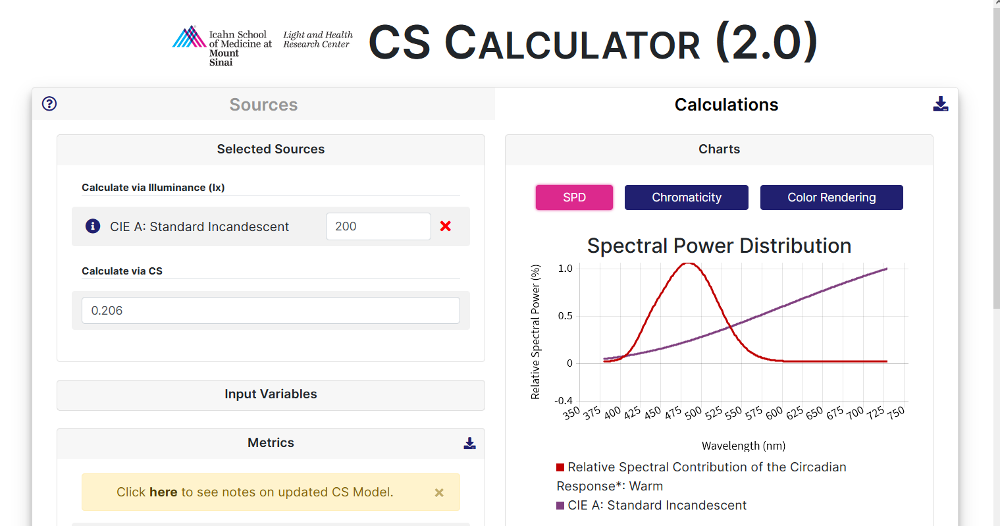

# CS-Calculator 2.0

The CS Calculator 2.0 is an open source web application tool that empowers lighting professionals to select light sources and light levels that will increase the potential for circadian-effective light exposure in architectural spaces, utilizing the CS metric. Provide the calculator with spectral power distribution (SPD) and illuminance data about your source(s) and recieve combined metrics, charts, and SPD's in return.

Access the CS Calculator 2.0 at [cscalc.light-health.org](https://cscalc.light-health.org).

## Documentation

Deatiled documentation for the CS Calculator 2.0 is available at [docs.light-health.org](https://docs.light-health.org/cscalc)

## Outputs

### Metrics

* CS
* CLA 2.0
* Illuminance
* Photo Flux
* Melanopic EDI
* CCT
* Duv
* CRI
* GAI
* Chromaticity Coordinates
* CIE S-cone Irradiance
* CIE M-cone Irradiance
* CIE L-cone Irradiance
* CIE Rhodopic Irradiance
* CIE Melanopic Irradiance

### Charts

* SPD
* Chromaticity
* Color Rendering

### SPD's

* Relative
* Absolute
